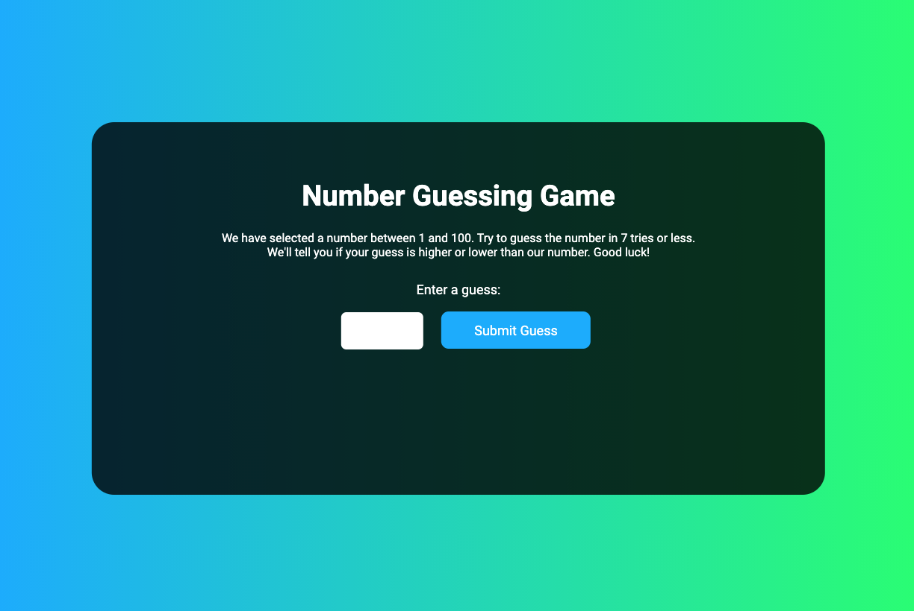

# Number Guessing Game
A number guessing game made with vanilla JavaScript, HTML and CSS. The rules are simple: a number between 1-100 is randomly chosen and the player has 7 turns to guess the number. The game shows the player's previous guesses
and lets the player know if their last guess was too high or low.  

To play the game, <a href="https://ivanamiovcic.github.io/Number-Guessing-Game/"> click here.</a> 

## Preview

